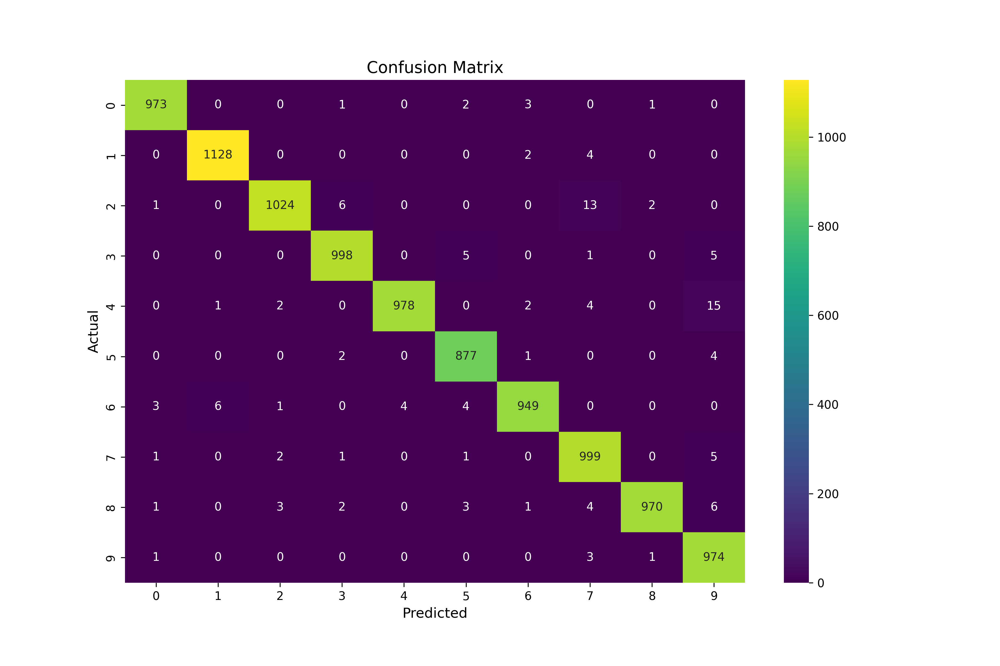

# ANN Image Classifier
Data science project using Artificial Neural Networks (ANN) for image classification of the MNIST data set.

# Overview
For this project I built an ANN to identify different handwritten numbers from 0-9. I used the well known [MNIST](http://yann.lecun.com/exdb/mnist/index.html) "Modified National Institute of Standards and Technology" dataset from computer vision which contains a large set (60,000 training and 10,000 test tensors) of handwritten images. The MNIST dataset is heavily used in the community to learn and practice new machine learning techniques. This project could be useful for new app developers or people in the educational system to determine what number a user (or student) is attempting to write. An notetaking app could incorporate this algorithm to turn hand written numbers into typed texts for better organization. My project could serve as a starting point or foundation for such algorithm (or app).

My model was able to predict handwritten digit images with a 98.46% accuracy with no tunning of the base model. For a base model, the accuracy reached could meet users criteria and with further training images and fine tuning, the model could be able to predict other images (i.e. math symbols or letters). To reach such accuracy, I used built-in Pytorch tools and created an architecture composed of Convolutional, Linear and Max Pool Layers. The base architecture allowed for time efficient and fairly accurate results.

# Notes
